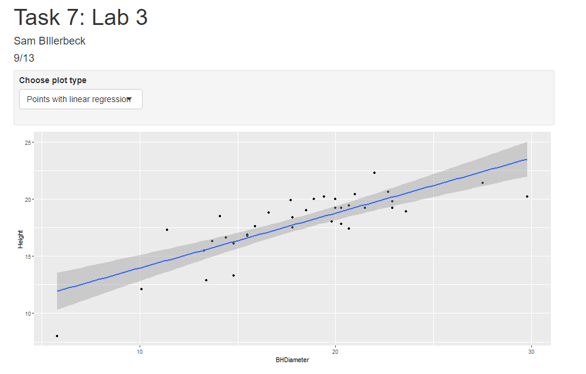
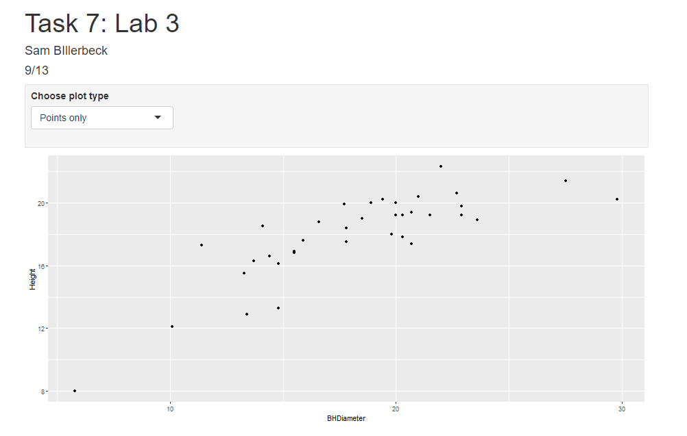
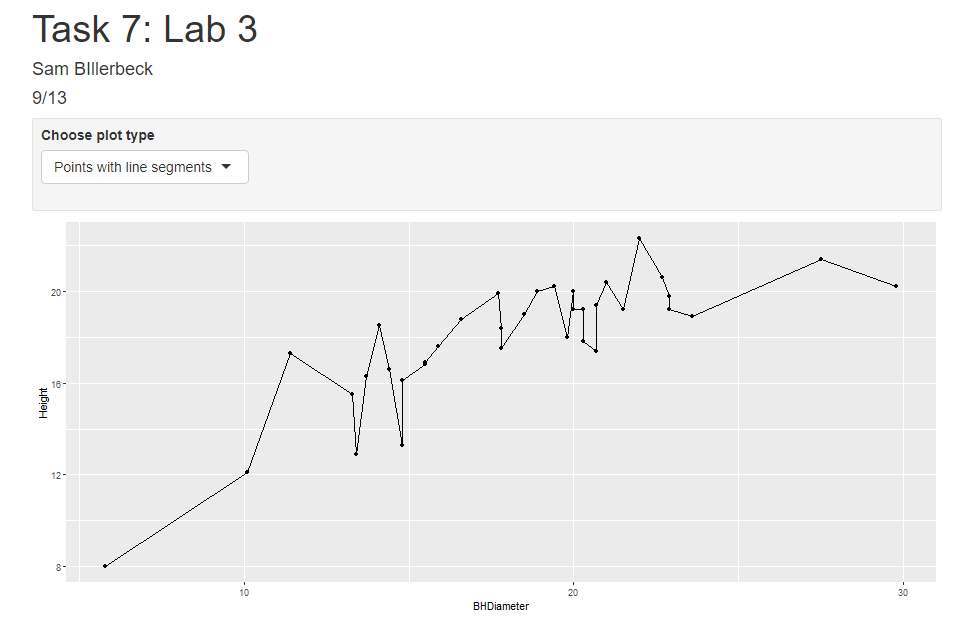

```{r setup, include=FALSE}
knitr::opts_chunk$set(echo = TRUE)
```


## Task 1

```{r}
getwd()
```
## Task 2

```{r}
spruce <- read.csv("SPRUCE.csv")
head(spruce)
```

## Task 3

```{r}
spruce <- read.csv("SPRUCE.csv")

library(ggplot2)

ggplot(aes(x = BHDiameter, y = Height), data = spruce) + geom_point(shape=21, fill="blue", size=1.2) + ggtitle("Plot of Height vs Diameter") + scale_x_continuous(expand = c(0, 0), limits = c(0, 1.1*max(spruce$BHDiameter))) + 
  scale_y_continuous(expand = c(0, 0), limits = c(0, 1.1*max(spruce$Height)))

```

Does there appear to be a straight line relationship?

Almost, but the graph begins to curve when diameter is about 17cm.

```{r}
library(s20x)

layout(matrix(1:4,nr=2,nc=2,byrow=TRUE))
trendscatter(spruce$Height~spruce$BHDiameter,f=.5)
trendscatter(spruce$Height~spruce$BHDiameter,f=.6)
trendscatter(spruce$Height~spruce$BHDiameter,f=.7)
plot(spruce$Height~spruce$BHDiameter,bg="Blue",pch=21,ylim=c(0,1.1*max(Height)),xlim=c(0,1.1*max(BHDiameter)), data=spruce)
mtext("Height Vs BHDiameter",side=3)
spruce.lm = with(spruce, lm(Height~BHDiameter))
abline(spruce.lm)
```

These plots clearly show that the straight line is not appropriate. It is fails to model the change in slope that occurs.

## Task 4

```{r}
layout(matrix(1:4,nr=2,nc=2,byrow=TRUE))
layout.show(4)
spruce.lm = with(spruce, lm(Height~BHDiameter))

plot(Height~BHDiameter,bg="Blue",pch=21,ylim=c(0,1.1*max(Height)),xlim=c(0,1.1*max(BHDiameter)), data=spruce)
abline(spruce.lm)
mtext("Height Vs BHDiameter",side=3)

yhat=fitted(spruce.lm)

plot(Height~BHDiameter,bg="Blue",pch=21,ylim=c(0,1.1*max(Height)),xlim=c(0,1.1*max(BHDiameter)), data=spruce)
with(spruce,{
  segments(BHDiameter,Height,BHDiameter,yhat)
})
abline(spruce.lm)
mtext("Height Vs BHDiameter",side=3)

plot(Height~BHDiameter,bg="Blue",pch=21,ylim=c(0,1.1*max(Height)),xlim=c(0,1.1*max(BHDiameter)), data=spruce)
with(spruce,{
  segments(BHDiameter,mean(Height),BHDiameter,yhat)
})
with(spruce, abline(h=mean(Height)))
abline(spruce.lm)
mtext("Height Vs BHDiameter",side=3)

plot(Height~BHDiameter,bg="Blue",pch=21,ylim=c(0,1.1*max(Height)),xlim=c(0,1.1*max(BHDiameter)), data=spruce)
with(spruce,abline(h=mean(Height)))
with(spruce, segments(BHDiameter,Height,BHDiameter,mean(Height),col="Green"))
mtext("Height Vs BHDiameter",side=3)


RSS=with(spruce,sum((Height-yhat)^2))
RSS

MSS=with(spruce,sum((yhat-mean(Height))^2))
MSS

TSS=with(spruce,sum((Height-mean(Height))^2))
TSS

MSS/TSS

TSS
MSS + RSS
```
MSS/TSS is the model sum of squares divided by the total sum of squares. This value tells us how accurate our model is compared to the actual data, where a number closer to 1 is better. This is also called the coefficient of determination.

TSS does equal MSS + RSS

## Task 5

```{r}
spruce.lm = with(spruce, lm(Height~BHDiameter))
summary(spruce.lm)
coef(spruce.lm)

```
Slope is .48147.

The intercept value is 9.14684.

The equation of the fitted line is Height = .48147*BHDiameter + 9.14684

```{r}
predict(spruce.lm, data.frame(BHDiameter=c(15,18,20)))

```
The predicted values for BHDiameter = 15, 18, and 20 cm are respectively 16.36895 17.81338 18.77632.

## Task 6

```{r}
ggplot(aes(x = BHDiameter, y = Height, colour = BHDiameter), data = spruce) + geom_point(shape=21, fill="blue", size=1.2) + ggtitle("Plot of Height vs Diameter") + scale_x_continuous(expand = c(0, 0), limits = c(0, 1.1*max(spruce$BHDiameter))) + 
  scale_y_continuous(expand = c(0, 0), limits = c(0, 1.1*max(spruce$Height))) + geom_smooth(method="lm")+geom_line()
```

## Task 7

{ width=70% }
{ width=70% }
{ width=70% }

Code used for task 7:


library(ggplot2)

spruce.df = read.csv("SPRUCE.csv")#MS pg478

inputPanel(
  
  
  selectInput("plotg", "Choose plot type",
      list(`points` = c("Points only", "Points with linear regression", "Points with line segments")
      )
    )
)

renderPlot({
  
 g = ggplot(spruce.df, aes(x = BHDiameter, y = Height)) + geom_point() 

 gsh =  g + geom_point() + geom_smooth(method="lm")
 
 gsr = g + geom_point() + geom_line()
  
 if(input$plotg == "Points only") print(g)
 
 if(input$plotg == "Points with linear regression")   print(gsh)
 
 if(input$plotg == "Points with line segments")   print(gsr)
 
   
})

